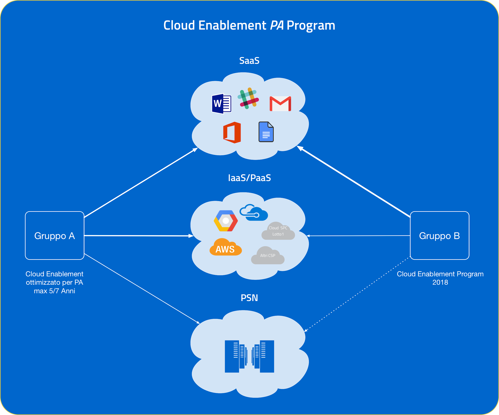
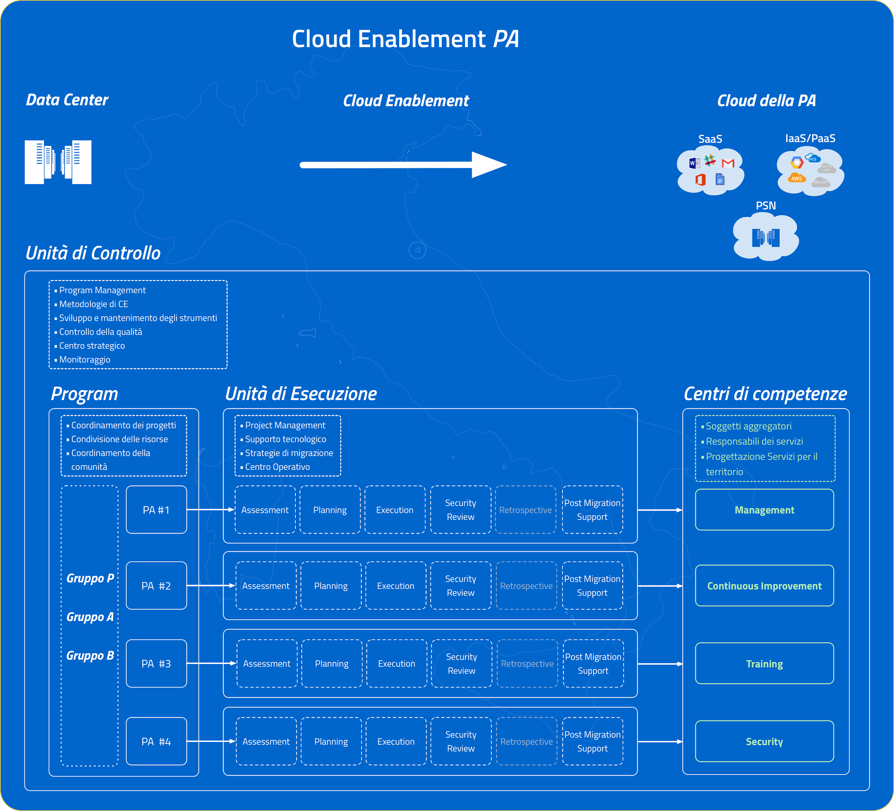
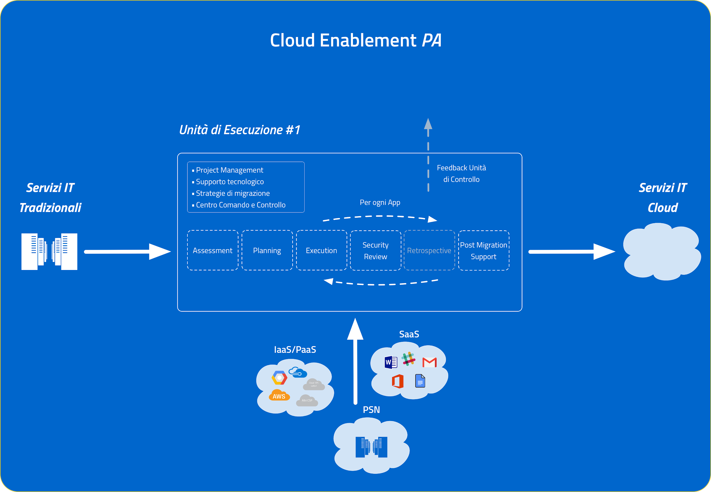

Cloud Enablement Program 
========================

Introduzione
------------

Nel 2013 AgID ha effettuato `un primo censimento <http://www.agid.gov.it/agenda-digitale/infrastrutture-architetture/razionalizzazione-del-patrimonio-ict-pa/censimento-data>`__ su 990 data center della PA, rilevando una forte frammentazione delle risorse e frequenti situazioni di inadeguatezza tecnologica.

La successiva ricognizione effettuata da AgID nel corso del 2016 ha indicato che, tra gli interventi di spesa ICT delle Pubbliche amministrazioni centrali (PAC), quelli relativi ai data center risultano i più numerosi, `per un importo pari a circa il 39% del totale <http://pianotriennale-ict.readthedocs.io/it/latest/doc/allegati/3_quadro-sinottico-della-spesa-ict-nelle-pubbliche-amministrazioni-centrali.html>`__. Ne emerge l’importanza della razionalizzazione delle infrastrutture fisiche, anche dal punto di vista economico.

Per quanto riguarda le attività di virtualizzazione del parco macchine, la Pubblica amministrazione ha utilizzato il cloud in modo estremamente frammentato, limitandosi all’adozione di pochissime soluzioni.

Considerando la situazione di elevata frammentazione e disomogeneità dei sistemi informativi delle PA, con questo documento viene definito un **percorso evolutivo che accompagni le PA stesse verso un utilizzo efficiente e flessibile delle tecnologie ICT** al fine di garantire elevate economie gestionali a favore di una maggior reattività nell’erogare servizi più adeguati alle esigenze di cittadini ed imprese.

Il consolidamento delle infrastrutture ICT della Pubblica Amministrazione implica una massiccia migrazione dei servizi attualmente erogati in modalità tradizionale verso un ambiente cloud.

Il percorso evolutivo è definito mediante due componenti principali: un **framework di lavoro** e **un programma di Cloud Enablement nazionale**, ovvero una serie di progetti specifici, uno per ogni PA.

Per cloud enablement si intende il processo che abilita un'organizzazione a creare, operare e mantenere le proprie infrastrutture IT utilizzando tecnologie cloud. Nell'ottica del consolidamento e della razionalizzazione, tale attività riorganizza i processi IT in ambienti di cloud pubblico, privato o ibrido.

Questo documento definisce il framework e il programma di *Cloud Enablement per la PA*.

Cloud Enablement Framework
--------------------------
Il framework di lavoro definisce le risorse, le strategie, le metodologie e gli strumenti per attuare il *Cloud Enablement Program* della PA.

Strategia Generale
^^^^^^^^^^^^^^^^^^

La Strategia generale del percorso di Cloud Enablement della PA è caratterizzata da due elementi principali:

-  consolidamento delle infrastrutture - *Cloud First* (SaaS First)

-  consolidamento delle competenze mediante la creazione di *Centri di Competenze* (Soggetti Aggregatori)

**Cloud First** è la strategia con la quale si cerca di favorire l’adozione di soluzioni Cloud rispetto ad alternative tradizionali, nello specifico della PA si cercherà di preferire soluzioni SaaS in modo da ridurre il più possibile l’overhead tecnico ed amministrativo delle amministrazioni dovuto alla gestione dei servizi IT che richiedono competenze specifiche.

Il secondo elemento della strategia di Cloud Enablement è costituito dalla costituzione di **centri di competenza sul territorio**. Tali centri hanno lo scopo di consolidare il *know how* e l’esperienza relativa ai servizi Cloud nella PA con il supporto di AgID e dell’Unità di Controllo, inoltre svolgono la funzione di soggetti aggregatori in grado di amministrare i servizi IT per conto di altre PA.

Al termine della migrazione, le attività di *Continuous Improvement, Training, Change Management* e ottimizzazione delle risorse Cloud, saranno affidate ai Centri di Competenze.

Nelle fasi successive i centri di competenze affiancheranno *l’unità di controllo* in qualità soggetti aggregatori al fine di progettare i servizi delle amministrazioni.

Risorse Cloud
^^^^^^^^^^^^^

Il Piano Triennale definisce come *Cloud della PA* tutte le infrastrutture a disposizione delle PA che è possibile utilizzare per erogare servizi IT.

Poli Strategici Nazionali
~~~~~~~~~~~~~~~~~~~~~~~~~

Sono i soggetti titolari dell’insieme di infrastrutture IT (centralizzate o distribuite), ad alta disponibilità, di proprietà pubblica e qualificati da AgID ad erogare servizi cloud:

-  infrastrutturali (es. housing, IaaS, PaaS, SaaS, ecc.);

-  per il disaster recovery e business continuity;

-  per la gestione della sicurezza IT;

Il percorso per la realizzazione di queste infrastrutture è ancora in fase di definizione e non sarà completato a breve termine. Quando saranno attivi i PSN avranno il compito di ospitare servizi e infrastrutture critiche, considerate sensibili per la sicurezza nazionale. I PSN saranno dedicati ad ospitare asset strategici nazionali per i quali non è possibile ricorrere ad infrastrutture in public cloud.

Cloud SPC Lotto 1
~~~~~~~~~~~~~~~~~

È un community cloud basato sulla piattaforma OpenStack che offre servizi di tipo IaaS,PaaS e SaaS. È il frutto di una gara Consip quindi ha il grosso vantaggio di poter essere acquistato dalla PA mediante convenzione Consip semplificando enormemente la fase di procurement, tuttavia i servizi di Cloud SPC presentano alcuni limiti tecnologici ed problemi operativi.

Cloud Service Provider
~~~~~~~~~~~~~~~~~~~~~~

Tutti i Cloud Service provider pubblici qualificati secondo quanto previsto dal Piano Triennale potranno erogare servizi di tipologia SaaS, PaaS e IaaS alla PA. L’elenco dei Cloud Service Provider e dei servizi da loro sarà disponibile nel Marketplace Cloud della PA.

|image0|

Unità di Controllo
------------------

*(Cloud Enablement Control Team )*

*L’unità di controllo* ha il compito di aggiornare, gestire e monitorare il programma di Cloud Enablement, è costituita da un team specializzato in attività di Cloud Enablement. Insieme ad AgID e il Team Digitale rappresenta la governance del progetto.

|image1|
~~~~~~~~

Definizione delle metodologie
~~~~~~~~~~~~~~~~~~~~~~~~~~~~~

L’unità di controllo definisce ed aggiorna le metodologie adottate nell’ambito del CE framework, in particolare per quanto riguarda il monitoraggio, l’assessment, le modalità di delivery e il controllo della qualità.

Sviluppo e mantenimento degli strumenti
~~~~~~~~~~~~~~~~~~~~~~~~~~~~~~~~~~~~~~~

L’unità di controllo è responsabile per gli strumenti di lavoro nell’ambito del CE Framework, si preoccupa di sviluppare/selezionare, mantenere ed aggiornare gli strumenti, inoltre presta supporto alle CE Squads affinchè vengano utilizzati correttamente.

Program Management
~~~~~~~~~~~~~~~~~~

L’unità di controllo è responsabile della gestione del programma di Cloud Enablement, del coordinamento dei progetti e del coordinamento delle CE squads. L’unità di controllo aggiorna il programma di Cloud Enablement tenendo in considerazione il feedback proveniente dalle CE Squads.

Controllo della qualità
~~~~~~~~~~~~~~~~~~~~~~~

L’unità di controllo è anche responsabile di verificare la qualità del delivery (la realizzazione di un progetto di Cloud Enablement), al termine di ogni progetto di migrazione dovrà verificare mediante opportuni strumenti (survey, design docs, test, etc) se quanto realizzato risponde ai parametri di qualità previsti dalla metodologia adottata.

Monitoraggio
~~~~~~~~~~~~

L’unità di controllo si preoccupa infine di monitorare l’intero programma in termini deliverables e KPI e per fare ciò svilupperà un’infrastruttura di monitoraggio, un’applicazione che da un lato abilita le PA e le Unità di Esecuzione ad attivare e monitorare il singolo progetto di migrazione, dall’altro fornisce una visione complessiva dello stato di avanzamento di tutti i progetti di migrazione in atto.

L’app (CEA ) dovrebbe:

-  registrare le attività di CE e riportare lo stato delle attività

-  gestire i meccanismi di supporto, bug tracker, ed escalation

-  accesso al marketplace che fornisce le opzioni mepa / gare consip disponibili al momento per attivare un servizio (SaaS, Cloud Pubblico etc)

-  consentire alle CE squad di monitorare ogni singolo processo di migrazione

Strumenti
~~~~~~~~~

L’unità di controllo seleziona, sviluppa e consolida gli strumenti nell’ambito del framework CE, in particolare sono due gli strumenti a disposizione

Cloud Enablement Kit - CEK
^^^^^^^^^^^^^^^^^^^^^^^^^^

Per *Cloud Enablement Kit* (CEK) si intende un repository che raccoglie la documentazione i playbook di migrazione, gli *use cases* e ogni tipo informazione o processo che è possibile astrarre e generalizzare inerente ad una specifica tipologia di PA (CEK per i Comuni, etc. ). I kit sono sviluppati durante il processo di migrazione e sono gestiti e mantenuti dalla comunità.

Cloud Enablement App - CEA
^^^^^^^^^^^^^^^^^^^^^^^^^^

CEA è un’applicazione per la gestione e il monitoraggio del processo di cloud enablement nelle PPAA. Un’applicazione che costituisce l’interfaccia tra le PA, l’unità di controllo e le squadre di Esecuzione. Inoltre l’applicazione fornisce un punto informativo unico in cui sono raccolti gli strumenti (project management, CEK, etc.) e tutte le informazioni per l’esecuzione del piano di migrazione.

Unità di Esecuzione
-------------------

*(Cloud Enablement Squads)*

*Le unità di esecuzione* oppure dette anche *CE Squads* sono i team responsabili della progettazione e dell’esecuzione di uno specifico progetto di Cloud Enablement. Le CE Squad sono responsabili per il delivery, svolgono quindi consulenza sul campo, progettando e implementando, insieme ad ogni PA, il percorso di migrazione di tutti i servizi IT.

Project Management
~~~~~~~~~~~~~~~~~~

Le CE Squads per ogni PA sviluppano un progetto di Cloud Enablement utilizzando gli strumenti forniti dall’Unità di Controllo, saranno quindi responsabili della gestione e dell’esecuzione del progetto.

Processo di Delivery
~~~~~~~~~~~~~~~~~~~~

Le CE squads sviluppano un progetto di migrazione per ogni PA che prendono in gestione, la realizzazione dei progetti costituisce il processo di delivery.

.. _section-1:

|image2|
^^^^^^^^

Assessment iniziale
^^^^^^^^^^^^^^^^^^^

Le *squads* effettuano inizialmente un assessment infrastrutturale e delle applicazioni utilizzate dalla PA, prestando particolare attenzione ad individuare la criticità di ogni applicazione ed eventuali interdipendenze. Al termine di questa fase iniziale si ottiene un catalogo delle delle infrastrutture da dismettere e delle applicazioni da migrare, congiuntamente ad una analisi complessiva dove si evidenziano possibili criticità nella fase di migrazione.

Progettazione del processo di migrazione
^^^^^^^^^^^^^^^^^^^^^^^^^^^^^^^^^^^^^^^^

Le *squads* insieme alle PA progettano il piano di migrazione individuando le architetture, le strategie di migrazione per le diverse applicazioni, le soluzioni cloud ed infine i tempi di esecuzione. Questa fase produce un piano di lavoro dettagliato che sarà messo in atto nella fase successiva. Il know how prodotto durante la progettazione deve essere consolidato dalle CE Squads all’interno dei Kit di migrazione (CEK).

Esecuzione della migrazione
^^^^^^^^^^^^^^^^^^^^^^^^^^^

L’esecuzione della migrazione è la parte operativa di tutto il processo, mediante le metodologie definite dalle squads con il supporto dell’unità di controllo, viene eseguito quanto descritto nel piano di migrazione frutto della precedente fase. Viene stabilito un centro di operativo di comando e controllo della migrazione in cui devono essere presenti anche componenti della PA coinvolta. Al termine di questa fase la PA dovrebbe poter disporre dei nuovi servizi IT in ambiente Cloud. Questa fase è iterativa, dovrebbe svolgersi per ogni applicazione, in modo che si possa verificare il corretto funzionamento dell’applicazione una volta migrata.

Security Review

Le unità di esecuzione effettuano la revisione della sicurezza applicativa e dell'infrastruttura, indicando le criticità per ogni ambito. La revisione prevede l’applicazione delle misure minime di sicurezza ICT per le pubbliche amministrazioni, emanate da AgID. Nell’ambito della web application security, è necessario applicare i controlli legati alle vulnerabilità più comuni, menzionate in dettaglio nella classifica TOP 10 del progetto OWASP.

La revisione di sicurezza deve essere eseguita sempre prima di considerare conclusa la fase di esecuzione, e viene effettuata in maniera iterativa ogni qual volta il ciclo di esecuzione introduce un nuovo cambiamento.

Retrospettiva post-migrazione

Al termine della fase di esecuzione le *squads* effettuano un’analisi retrospettiva del processo di migrazione cercando di evidenziare le problematiche emerse nel progetto specifico. Le “lessons learnt” emerse in questa fase vengono presentate all’unità di controllo che le consolida in una knowledge base comune.

.. _strumenti-1:

Strumenti
~~~~~~~~~

Le unità di esecuzione si avvalgono degli strumenti necessari per la progettazione ed esecuzione del progetto di migrazione, gli strumenti comuni che possono essere riutilizzati nei progetti successivi vengono raccolti nel CEK.

Gli strumenti a disposizione delle unità di esecuzione sono:

-  Sistema di controllo del processo di delivery

-  Sistema di issue tracking

-  Metodologia di assessment

-  Catalogo delle strategie di migrazione

-  Raccolta dei case studies già realizzati / linee guida / best practices

-  CE playbooks organizzati per tipologia di applicazioni

Supporto post migrazione
~~~~~~~~~~~~~~~~~~~~~~~~

-  L1 Support viene svolto dalle cloud enablement squads che eseguono il piano di migrazione

-  L2 Support viene invece svolto direttamente dal Team di Controllo.

Per un tempo limitato ~ 6mesi

Cloud Enablement Program
========================

L’unità di controllo definisce e aggiorna il programma di Cloud Enablement, descrivendo tempi e modalità dei progetti di migrazione.

Gruppo Pilota
-------------

Per testare il framework di lavoro verranno scelte alcune PA interessate a migrare i propri servizi in Cloud. Le PA saranno scelte dal Gruppo A e dal Gruppo B in modo da coprire un ampio spettro di problematiche che si affronteranno nei passaggi successivi.

Il Gruppo Pilota è supportato dai finanziamenti della Scheda 3 di Italia Login, le amministrazioni che rientro in questo gruppo si faranno carico solo dei costi delle infrastrutture e non del processo di trasformazione.

L’unità di controllo dovrà effettuare le stime per valutare i costi del processo di migrazione e valutare quanti progetti attivare nell’ambito del gruppo pilota.

Gruppo A
--------

**Il Gruppo A** costituito dai *Data center* di medie/grandi dimensioni ma con carenze strutturali o organizzative, su i quali sono stati fatti degli investimenti recenti.

La migrazione del gruppo A è ancora tutta da definire perché non è ancora chiaro che tipologia di infrastrutture afferiranno a questo gruppo, in funzione di quello che saranno i PSN. In ogni caso il gruppo A richiede una migrazione di lungo periodo dovuta alla criticità dei servizi ospitati da queste strutture.

Gruppo B
--------

**Il Gruppo B** costituito da tutti quei *Data center* che *non garantiscono* requisiti minimi di affidabilità e sicurezza dal punto di vista infrastrutturale e/o organizzativo.

Le infrastrutture appartenenti a questo gruppo dovranno essere migrate il prima possibile, una parte rientrerà nel gruppo pilota, l’unità di controllo dovrà dimensionare il gruppo valutare in che modo procedere per consentire la migrazione di tutte le infrastrutture di tipo B.

Strategia Gare
==============

Per avviare più velocemente la fase iniziale è necessario attivare una prima Gara MEPA per l’individuazione dell’\ *Unità di Controllo,* infatti è necessario scegliere il soggetto che guiderà il CEP in modo da coinvolgerlo nella fase fin dalla fase di progettazione del Framework e del Programma.

Sarà poi necessario procedere con una seconda gara in questo caso un procedimento ad evidenza pubblica con diversi lotti in modo da individuare le unità di esecuzione su base regionale ed estendere l'operatività dell’unità di controllo.

Gara MEPA
---------

+--------------------------------------------+------------------------------------------------------------------------------------------------------------------------------------------------------------------------------------------------------------------------------------------------------------------------------------------------------------------------------------------------------------------------------------------------------------------------------------------------------------------------------------------------------------------+
| .. rubric:: Unità di Controllo - Bootstrap |                                                                                                                                                                                                                                                                                                                                                                                                                                                                                                                  |
|    :name: unità-di-controllo---bootstrap   |                                                                                                                                                                                                                                                                                                                                                                                                                                                                                                                  |
+============================================+==================================================================================================================================================================================================================================================================================================================================================================================================================================================================================================================+
| **Scopo:**                                 | Individuazione dell’Unità di Controllo                                                                                                                                                                                                                                                                                                                                                                                                                                                                           |
+--------------------------------------------+------------------------------------------------------------------------------------------------------------------------------------------------------------------------------------------------------------------------------------------------------------------------------------------------------------------------------------------------------------------------------------------------------------------------------------------------------------------------------------------------------------------+
| **Tipologia Gara:**                        | Gara MEPA                                                                                                                                                                                                                                                                                                                                                                                                                                                                                                        |
+--------------------------------------------+------------------------------------------------------------------------------------------------------------------------------------------------------------------------------------------------------------------------------------------------------------------------------------------------------------------------------------------------------------------------------------------------------------------------------------------------------------------------------------------------------------------+
| **Caratteristiche fornitore**:             | -  Deve proporre un team di 4 / 5 persone                                                                                                                                                                                                                                                                                                                                                                                                                                                                        |
|                                            |                                                                                                                                                                                                                                                                                                                                                                                                                                                                                                                  |
|                                            | -  Azienda con fatturato specifico rispetto ad attività di consulenza di *cloud transformation*                                                                                                                                                                                                                                                                                                                                                                                                                  |
|                                            |                                                                                                                                                                                                                                                                                                                                                                                                                                                                                                                  |
|                                            | -  Certificazioni: ISO 9001, ISO 20000, ISO 27001, ISO 27017                                                                                                                                                                                                                                                                                                                                                                                                                                                     |
|                                            |                                                                                                                                                                                                                                                                                                                                                                                                                                                                                                                  |
|                                            | -  Competenze:                                                                                                                                                                                                                                                                                                                                                                                                                                                                                                   |
|                                            |                                                                                                                                                                                                                                                                                                                                                                                                                                                                                                                  |
|                                            |    -  program/project management;                                                                                                                                                                                                                                                                                                                                                                                                                                                                                |
|                                            |                                                                                                                                                                                                                                                                                                                                                                                                                                                                                                                  |
|                                            |    -  Cloud expertise sulle principali tecnologie cloud (GCP, AWS, Azure, IBM, OpenStack, Kubernetes, etc);                                                                                                                                                                                                                                                                                                                                                                                                      |
|                                            |                                                                                                                                                                                                                                                                                                                                                                                                                                                                                                                  |
|                                            |    -  Esperienza nello sviluppo di progetti OpenSource                                                                                                                                                                                                                                                                                                                                                                                                                                                           |
|                                            |                                                                                                                                                                                                                                                                                                                                                                                                                                                                                                                  |
|                                            |    -  Supporto ai processi di procurement PA per l’acquisto dei servizi Cloud                                                                                                                                                                                                                                                                                                                                                                                                                                    |
|                                            |                                                                                                                                                                                                                                                                                                                                                                                                                                                                                                                  |
|                                            |    -  Esperienza legale e tecnica nella definizione e valutazione degli SLA                                                                                                                                                                                                                                                                                                                                                                                                                                      |
+--------------------------------------------+------------------------------------------------------------------------------------------------------------------------------------------------------------------------------------------------------------------------------------------------------------------------------------------------------------------------------------------------------------------------------------------------------------------------------------------------------------------------------------------------------------------+
| **Responsabilità**                         | -  Esecuzione e monitoraggio del Programma di migrazione                                                                                                                                                                                                                                                                                                                                                                                                                                                         |
|                                            |                                                                                                                                                                                                                                                                                                                                                                                                                                                                                                                  |
|                                            | -  Coordinamento e controllo qualità delle attività dei team sul campo (Lotto 2)                                                                                                                                                                                                                                                                                                                                                                                                                                 |
|                                            |                                                                                                                                                                                                                                                                                                                                                                                                                                                                                                                  |
|                                            | -  Mantenimento e sviluppo del CEK e della CEA                                                                                                                                                                                                                                                                                                                                                                                                                                                                   |
+--------------------------------------------+------------------------------------------------------------------------------------------------------------------------------------------------------------------------------------------------------------------------------------------------------------------------------------------------------------------------------------------------------------------------------------------------------------------------------------------------------------------------------------------------------------------+
| **Descrizione:**                           | Seguendo la strategia elaborata da AgID e dal Team Digitale il soggetto selezionato dovrà coordinare le amministrazioni e i team del lotto 2 nel processo di migrazione, guidare e aggiornare lo sviluppo dei CEK (Kit di migrazione) e della CEA (Applicazione di monitoraggio), effettuare il controllo di qualità su i processi di migrazioni in corso ed infine monitorare lo stato di avanzamento globale del programma di migrazione CEP. Intervenire su eventuali problematiche nella fase di esecuzione. |
+--------------------------------------------+------------------------------------------------------------------------------------------------------------------------------------------------------------------------------------------------------------------------------------------------------------------------------------------------------------------------------------------------------------------------------------------------------------------------------------------------------------------------------------------------------------------+
| **Riferimento economico**:                 |                                                                                                                                                                                                                                                                                                                                                                                                                                                                                                                  |
+--------------------------------------------+------------------------------------------------------------------------------------------------------------------------------------------------------------------------------------------------------------------------------------------------------------------------------------------------------------------------------------------------------------------------------------------------------------------------------------------------------------------------------------------------------------------+
| **Stazione appaltante**:                   | Agenzia per l’Italia Digitale                                                                                                                                                                                                                                                                                                                                                                                                                                                                                    |
+--------------------------------------------+------------------------------------------------------------------------------------------------------------------------------------------------------------------------------------------------------------------------------------------------------------------------------------------------------------------------------------------------------------------------------------------------------------------------------------------------------------------------------------------------------------------+
| **Elementi di valutazione:**               |                                                                                                                                                                                                                                                                                                                                                                                                                                                                                                                  |
+--------------------------------------------+------------------------------------------------------------------------------------------------------------------------------------------------------------------------------------------------------------------------------------------------------------------------------------------------------------------------------------------------------------------------------------------------------------------------------------------------------------------------------------------------------------------+

.. _section-2:

Procedimento ad Evidenza Pubblica
---------------------------------

Per procedere all'acquisizione delle risorse necessarie all’attuazione del Cloud Enablement Program mediante il framework descritto è necessario bandire una procedimento ad evidenza pubblica così composto:

-  lotto 1 il cui obiettivo è quello di rinnovare e potenziare il supporto dell’unità di controllo

-  lotti 2,3,4 e 5 con l’obiettivo di individuare le società di consulenza in grado di operare come unità di esecuzione sul territorio nazionale. Ogni lotto è diviso per area geografica.

+------------------------------------------+------------------------------------------------------------------------------------------------------------------------------------------------------------------------------------------------------------------------------------------------------------------------------------------------------------------------------------------------------------------------------------------------------------------------------------------------------------------------------------------------------------------+
| .. rubric:: Unità di Controllo - Lotto 1 |                                                                                                                                                                                                                                                                                                                                                                                                                                                                                                                  |
|    :name: unità-di-controllo---lotto-1   |                                                                                                                                                                                                                                                                                                                                                                                                                                                                                                                  |
+==========================================+==================================================================================================================================================================================================================================================================================================================================================================================================================================================================================================================+
| **Scopo:**                               | Individuazione dell’Unità di Controllo                                                                                                                                                                                                                                                                                                                                                                                                                                                                           |
+------------------------------------------+------------------------------------------------------------------------------------------------------------------------------------------------------------------------------------------------------------------------------------------------------------------------------------------------------------------------------------------------------------------------------------------------------------------------------------------------------------------------------------------------------------------+
| **Tipologia Gara:**                      | Procedimento ad evidenza pubblica                                                                                                                                                                                                                                                                                                                                                                                                                                                                                |
+------------------------------------------+------------------------------------------------------------------------------------------------------------------------------------------------------------------------------------------------------------------------------------------------------------------------------------------------------------------------------------------------------------------------------------------------------------------------------------------------------------------------------------------------------------------+
| **Caratteristiche fornitore**:           | -  Deve proporre un team di 4 / 5 persone                                                                                                                                                                                                                                                                                                                                                                                                                                                                        |
|                                          |                                                                                                                                                                                                                                                                                                                                                                                                                                                                                                                  |
|                                          | -  Azienda con fatturato specifico rispetto ad attività di consulenza di *cloud transformation*                                                                                                                                                                                                                                                                                                                                                                                                                  |
|                                          |                                                                                                                                                                                                                                                                                                                                                                                                                                                                                                                  |
|                                          | -  Certificazioni: ISO 9001, ISO 20000, ISO 27001, ISO 27017                                                                                                                                                                                                                                                                                                                                                                                                                                                     |
|                                          |                                                                                                                                                                                                                                                                                                                                                                                                                                                                                                                  |
|                                          | -  Competenze:                                                                                                                                                                                                                                                                                                                                                                                                                                                                                                   |
|                                          |                                                                                                                                                                                                                                                                                                                                                                                                                                                                                                                  |
|                                          |    -  program/project management;                                                                                                                                                                                                                                                                                                                                                                                                                                                                                |
|                                          |                                                                                                                                                                                                                                                                                                                                                                                                                                                                                                                  |
|                                          |    -  Cloud expertise sulle principali tecnologie cloud (GCP, AWS, Azure, IBM, OpenStack, Kubernetes, etc);                                                                                                                                                                                                                                                                                                                                                                                                      |
|                                          |                                                                                                                                                                                                                                                                                                                                                                                                                                                                                                                  |
|                                          |    -  Esperienza nello sviluppo di progetti OpenSource                                                                                                                                                                                                                                                                                                                                                                                                                                                           |
|                                          |                                                                                                                                                                                                                                                                                                                                                                                                                                                                                                                  |
|                                          |    -  Supporto ai processi di procurement PA per l’acquisto dei servizi Cloud                                                                                                                                                                                                                                                                                                                                                                                                                                    |
|                                          |                                                                                                                                                                                                                                                                                                                                                                                                                                                                                                                  |
|                                          |    -  Esperienza legale e tecnica nella definizione e valutazione degli SLA                                                                                                                                                                                                                                                                                                                                                                                                                                      |
+------------------------------------------+------------------------------------------------------------------------------------------------------------------------------------------------------------------------------------------------------------------------------------------------------------------------------------------------------------------------------------------------------------------------------------------------------------------------------------------------------------------------------------------------------------------+
| **Responsabilità**                       | -  Esecuzione e monitoraggio del Programma di migrazione                                                                                                                                                                                                                                                                                                                                                                                                                                                         |
|                                          |                                                                                                                                                                                                                                                                                                                                                                                                                                                                                                                  |
|                                          | -  Coordinamento e controllo qualità delle attività dei team sul campo (Lotto 2)                                                                                                                                                                                                                                                                                                                                                                                                                                 |
|                                          |                                                                                                                                                                                                                                                                                                                                                                                                                                                                                                                  |
|                                          | -  Mantenimento e sviluppo del CEK e della CEA                                                                                                                                                                                                                                                                                                                                                                                                                                                                   |
+------------------------------------------+------------------------------------------------------------------------------------------------------------------------------------------------------------------------------------------------------------------------------------------------------------------------------------------------------------------------------------------------------------------------------------------------------------------------------------------------------------------------------------------------------------------+
| **Descrizione:**                         | Seguendo la strategia elaborata da AgID e dal Team Digitale il soggetto selezionato dovrà coordinare le amministrazioni e i team del lotto 2 nel processo di migrazione, guidare e aggiornare lo sviluppo dei CEK (Kit di migrazione) e della CEA (Applicazione di monitoraggio), effettuare il controllo di qualità su i processi di migrazioni in corso ed infine monitorare lo stato di avanzamento globale del programma di migrazione CEP. Intervenire su eventuali problematiche nella fase di esecuzione. |
+------------------------------------------+------------------------------------------------------------------------------------------------------------------------------------------------------------------------------------------------------------------------------------------------------------------------------------------------------------------------------------------------------------------------------------------------------------------------------------------------------------------------------------------------------------------+
| **Riferimento economico**:               |                                                                                                                                                                                                                                                                                                                                                                                                                                                                                                                  |
+------------------------------------------+------------------------------------------------------------------------------------------------------------------------------------------------------------------------------------------------------------------------------------------------------------------------------------------------------------------------------------------------------------------------------------------------------------------------------------------------------------------------------------------------------------------+
| **Stazione appaltante**:                 | Agenzia per l’Italia Digitale                                                                                                                                                                                                                                                                                                                                                                                                                                                                                    |
+------------------------------------------+------------------------------------------------------------------------------------------------------------------------------------------------------------------------------------------------------------------------------------------------------------------------------------------------------------------------------------------------------------------------------------------------------------------------------------------------------------------------------------------------------------------+
| **Elementi di valutazione:**             |                                                                                                                                                                                                                                                                                                                                                                                                                                                                                                                  |
+------------------------------------------+------------------------------------------------------------------------------------------------------------------------------------------------------------------------------------------------------------------------------------------------------------------------------------------------------------------------------------------------------------------------------------------------------------------------------------------------------------------------------------------------------------------+

.. _section-3:

+----------------------------------------------+----------------------------------------------------------------------------------------------------------------------------------------------------------------------------------------------------------------------------------------------------------------------------------------------------------------------------------------------------------------+
| .. rubric:: Unità di esecuzione #1 - Lotto 2 |                                                                                                                                                                                                                                                                                                                                                                |
|    :name: unità-di-esecuzione-1---lotto-2    |                                                                                                                                                                                                                                                                                                                                                                |
+==============================================+================================================================================================================================================================================================================================================================================================================================================================+
| **Scopo:**                                   | Individuare l’unità di esecuzione per l’area #1                                                                                                                                                                                                                                                                                                                |
+----------------------------------------------+----------------------------------------------------------------------------------------------------------------------------------------------------------------------------------------------------------------------------------------------------------------------------------------------------------------------------------------------------------------+
| **Tipologia Gara:**                          | Procedimento ad evidenza pubblica                                                                                                                                                                                                                                                                                                                              |
+----------------------------------------------+----------------------------------------------------------------------------------------------------------------------------------------------------------------------------------------------------------------------------------------------------------------------------------------------------------------------------------------------------------------+
| **Caratteristiche fornitore**:               | -  Saranno necessarie diversi team , da attivare adeguatamente in base alle necessità , per rispondere al fabbisogno di richieste.                                                                                                                                                                                                                             |
|                                              |                                                                                                                                                                                                                                                                                                                                                                |
|                                              | -  Aziende con fatturato specifico su attività di consulenza di cloud migration e data center management                                                                                                                                                                                                                                                       |
|                                              |                                                                                                                                                                                                                                                                                                                                                                |
|                                              | -  Certificazioni ISO 9001, ISO 27001 , ISO 20000, ISO 27017                                                                                                                                                                                                                                                                                                   |
|                                              |                                                                                                                                                                                                                                                                                                                                                                |
|                                              | -  Competenze:                                                                                                                                                                                                                                                                                                                                                 |
|                                              |                                                                                                                                                                                                                                                                                                                                                                |
|                                              |    -  project management;                                                                                                                                                                                                                                                                                                                                      |
|                                              |                                                                                                                                                                                                                                                                                                                                                                |
|                                              |    -  cloud expertise sulle principali tecnologie cloud (GCP, AWS, Azure, IBM, OpenStack, Kubernetes, etc);                                                                                                                                                                                                                                                    |
|                                              |                                                                                                                                                                                                                                                                                                                                                                |
|                                              |    -  Esperienza nello sviluppo di progetti OpenSource                                                                                                                                                                                                                                                                                                         |
|                                              |                                                                                                                                                                                                                                                                                                                                                                |
|                                              |    -  Esperienze pregresse documentate di attività di Cloud migration e data center migration                                                                                                                                                                                                                                                                  |
|                                              |                                                                                                                                                                                                                                                                                                                                                                |
|                                              |    -  Conoscenza nei processi di procurement PA                                                                                                                                                                                                                                                                                                                |
|                                              |                                                                                                                                                                                                                                                                                                                                                                |
|                                              |    -  Esperienza legale e tecnica nella valutazione degli SLA                                                                                                                                                                                                                                                                                                  |
+----------------------------------------------+----------------------------------------------------------------------------------------------------------------------------------------------------------------------------------------------------------------------------------------------------------------------------------------------------------------------------------------------------------------+
| **Responsabilità**                           | -  Gestione dei progetti di CE per l’area geografica di riferimento                                                                                                                                                                                                                                                                                            |
|                                              |                                                                                                                                                                                                                                                                                                                                                                |
|                                              | -  Consulenza IT per i progetti di migrazione Cloud                                                                                                                                                                                                                                                                                                            |
|                                              |                                                                                                                                                                                                                                                                                                                                                                |
|                                              | -  Esecuzione dei progetti di migrazione secondo le direttive impartite dall’Unità di Controllo                                                                                                                                                                                                                                                                |
|                                              |                                                                                                                                                                                                                                                                                                                                                                |
|                                              | -  Raccolta e sviluppo dei playbooks di migrazione e consolidamento dei CEK.                                                                                                                                                                                                                                                                                   |
|                                              |                                                                                                                                                                                                                                                                                                                                                                |
|                                              | -  Redazione della documentazione del processo di migrazione                                                                                                                                                                                                                                                                                                   |
|                                              |                                                                                                                                                                                                                                                                                                                                                                |
|                                              | -  Formazione del personale PA all’uso dei servizi migrati.                                                                                                                                                                                                                                                                                                    |
+----------------------------------------------+----------------------------------------------------------------------------------------------------------------------------------------------------------------------------------------------------------------------------------------------------------------------------------------------------------------------------------------------------------------+
| **Descrizione:**                             | Le aziende selezionate dovranno supportare le amministrazioni pubbliche nella definizione e ed esecuzione del progetto di Cloud Enablement , secondo quanto indicato nel Cloud Enablement Framework.                                                                                                                                                           |
|                                              |                                                                                                                                                                                                                                                                                                                                                                |
|                                              | Per ogni amministrazione verrà delineato un progetto di cloud enablement specifico seguendo le linee guida impartite dall’Unità di Controllo, tale progetto verrà poi documentato in tutte le sue fasi e le soluzioni utilizzate verranno raccolte all’interno dei Cloud Enablement Kit. I soggetti selezionati in questo lotto dovranno riportare al Lotto 1. |
+----------------------------------------------+----------------------------------------------------------------------------------------------------------------------------------------------------------------------------------------------------------------------------------------------------------------------------------------------------------------------------------------------------------------+
| **Riferimento economico**:                   |                                                                                                                                                                                                                                                                                                                                                                |
+----------------------------------------------+----------------------------------------------------------------------------------------------------------------------------------------------------------------------------------------------------------------------------------------------------------------------------------------------------------------------------------------------------------------+
| **Stazione appaltante**:                     | Agenzia per l’Italia Digitale                                                                                                                                                                                                                                                                                                                                  |
+----------------------------------------------+----------------------------------------------------------------------------------------------------------------------------------------------------------------------------------------------------------------------------------------------------------------------------------------------------------------------------------------------------------------+
| **Elementi di valutazione:**                 |                                                                                                                                                                                                                                                                                                                                                                |
+----------------------------------------------+----------------------------------------------------------------------------------------------------------------------------------------------------------------------------------------------------------------------------------------------------------------------------------------------------------------------------------------------------------------+

.. _section-4:

+----------------------------------------------+----------------------------------------------------------------------------------------------------------------------------------------------------------------------------------------------------------------------------------------------------------------------------------------------------------------------------------------------------------------+
| .. rubric:: Unità di esecuzione #2 - Lotto 3 |                                                                                                                                                                                                                                                                                                                                                                |
|    :name: unità-di-esecuzione-2---lotto-3    |                                                                                                                                                                                                                                                                                                                                                                |
+==============================================+================================================================================================================================================================================================================================================================================================================================================================+
| **Scopo:**                                   | Individuare l’unità di esecuzione per l’area #2                                                                                                                                                                                                                                                                                                                |
+----------------------------------------------+----------------------------------------------------------------------------------------------------------------------------------------------------------------------------------------------------------------------------------------------------------------------------------------------------------------------------------------------------------------+
| **Tipologia Gara:**                          | Procedimento ad evidenza pubblica                                                                                                                                                                                                                                                                                                                              |
+----------------------------------------------+----------------------------------------------------------------------------------------------------------------------------------------------------------------------------------------------------------------------------------------------------------------------------------------------------------------------------------------------------------------+
| **Caratteristiche fornitore**:               | -  Saranno necessarie diversi team , da attivare adeguatamente in base alle necessità , per rispondere al fabbisogno di richieste.                                                                                                                                                                                                                             |
|                                              |                                                                                                                                                                                                                                                                                                                                                                |
|                                              | -  Aziende con fatturato specifico su attività di consulenza di cloud migration e data center management                                                                                                                                                                                                                                                       |
|                                              |                                                                                                                                                                                                                                                                                                                                                                |
|                                              | -  Certificazioni ISO 9001, ISO 27001 , ISO 20000, ISO 27017                                                                                                                                                                                                                                                                                                   |
|                                              |                                                                                                                                                                                                                                                                                                                                                                |
|                                              | -  Competenze:                                                                                                                                                                                                                                                                                                                                                 |
|                                              |                                                                                                                                                                                                                                                                                                                                                                |
|                                              |    -  project management;                                                                                                                                                                                                                                                                                                                                      |
|                                              |                                                                                                                                                                                                                                                                                                                                                                |
|                                              |    -  cloud expertise sulle principali tecnologie cloud (GCP, AWS, Azure, IBM, OpenStack, Kubernetes, etc);                                                                                                                                                                                                                                                    |
|                                              |                                                                                                                                                                                                                                                                                                                                                                |
|                                              |    -  Esperienza nello sviluppo di progetti OpenSource                                                                                                                                                                                                                                                                                                         |
|                                              |                                                                                                                                                                                                                                                                                                                                                                |
|                                              |    -  Esperienze pregresse documentate di attività di Cloud migration e data center migration                                                                                                                                                                                                                                                                  |
|                                              |                                                                                                                                                                                                                                                                                                                                                                |
|                                              |    -  Conoscenza nei processi di procurement PA                                                                                                                                                                                                                                                                                                                |
|                                              |                                                                                                                                                                                                                                                                                                                                                                |
|                                              |    -  Esperienza legale e tecnica nella valutazione degli SLA                                                                                                                                                                                                                                                                                                  |
+----------------------------------------------+----------------------------------------------------------------------------------------------------------------------------------------------------------------------------------------------------------------------------------------------------------------------------------------------------------------------------------------------------------------+
| **Responsabilità**                           | -  Gestione dei progetti di CE per l’area geografica di riferimento                                                                                                                                                                                                                                                                                            |
|                                              |                                                                                                                                                                                                                                                                                                                                                                |
|                                              | -  Consulenza IT per i progetti di migrazione Cloud                                                                                                                                                                                                                                                                                                            |
|                                              |                                                                                                                                                                                                                                                                                                                                                                |
|                                              | -  Esecuzione dei progetti di migrazione secondo le direttive impartite dall’Unità di Controllo                                                                                                                                                                                                                                                                |
|                                              |                                                                                                                                                                                                                                                                                                                                                                |
|                                              | -  Raccolta e sviluppo dei playbooks di migrazione e consolidamento dei CEK.                                                                                                                                                                                                                                                                                   |
|                                              |                                                                                                                                                                                                                                                                                                                                                                |
|                                              | -  Redazione della documentazione del processo di migrazione                                                                                                                                                                                                                                                                                                   |
|                                              |                                                                                                                                                                                                                                                                                                                                                                |
|                                              | -  Formazione del personale PA all’uso dei servizi migrati.                                                                                                                                                                                                                                                                                                    |
+----------------------------------------------+----------------------------------------------------------------------------------------------------------------------------------------------------------------------------------------------------------------------------------------------------------------------------------------------------------------------------------------------------------------+
| **Descrizione:**                             | Le aziende selezionate dovranno supportare le amministrazioni pubbliche nella definizione e ed esecuzione del progetto di Cloud Enablement , secondo quanto indicato nel Cloud Enablement Framework.                                                                                                                                                           |
|                                              |                                                                                                                                                                                                                                                                                                                                                                |
|                                              | Per ogni amministrazione verrà delineato un progetto di cloud enablement specifico seguendo le linee guida impartite dall’Unità di Controllo, tale progetto verrà poi documentato in tutte le sue fasi e le soluzioni utilizzate verranno raccolte all’interno dei Cloud Enablement Kit. I soggetti selezionati in questo lotto dovranno riportare al Lotto 1. |
+----------------------------------------------+----------------------------------------------------------------------------------------------------------------------------------------------------------------------------------------------------------------------------------------------------------------------------------------------------------------------------------------------------------------+
| **Riferimento economico**:                   |                                                                                                                                                                                                                                                                                                                                                                |
+----------------------------------------------+----------------------------------------------------------------------------------------------------------------------------------------------------------------------------------------------------------------------------------------------------------------------------------------------------------------------------------------------------------------+
| **Stazione appaltante**:                     | Agenzia per l’Italia Digitale                                                                                                                                                                                                                                                                                                                                  |
+----------------------------------------------+----------------------------------------------------------------------------------------------------------------------------------------------------------------------------------------------------------------------------------------------------------------------------------------------------------------------------------------------------------------+
| **Elementi di valutazione:**                 |                                                                                                                                                                                                                                                                                                                                                                |
+----------------------------------------------+----------------------------------------------------------------------------------------------------------------------------------------------------------------------------------------------------------------------------------------------------------------------------------------------------------------------------------------------------------------+

.. _section-5:

+----------------------------------------------+----------------------------------------------------------------------------------------------------------------------------------------------------------------------------------------------------------------------------------------------------------------------------------------------------------------------------------------------------------------+
| .. rubric:: Unità di esecuzione #3 - Lotto 4 |                                                                                                                                                                                                                                                                                                                                                                |
|    :name: unità-di-esecuzione-3---lotto-4    |                                                                                                                                                                                                                                                                                                                                                                |
+==============================================+================================================================================================================================================================================================================================================================================================================================================================+
| **Scopo:**                                   | Individuare l’unità di esecuzione per l’area #3                                                                                                                                                                                                                                                                                                                |
+----------------------------------------------+----------------------------------------------------------------------------------------------------------------------------------------------------------------------------------------------------------------------------------------------------------------------------------------------------------------------------------------------------------------+
| **Tipologia Gara:**                          | Procedimento ad evidenza pubblica                                                                                                                                                                                                                                                                                                                              |
+----------------------------------------------+----------------------------------------------------------------------------------------------------------------------------------------------------------------------------------------------------------------------------------------------------------------------------------------------------------------------------------------------------------------+
| **Caratteristiche fornitore**:               | -  Saranno necessarie diversi team , da attivare adeguatamente in base alle necessità , per rispondere al fabbisogno di richieste.                                                                                                                                                                                                                             |
|                                              |                                                                                                                                                                                                                                                                                                                                                                |
|                                              | -  Aziende con fatturato specifico su attività di consulenza di cloud migration e data center management                                                                                                                                                                                                                                                       |
|                                              |                                                                                                                                                                                                                                                                                                                                                                |
|                                              | -  Certificazioni ISO 9001, ISO 27001 , ISO 20000, ISO 27017                                                                                                                                                                                                                                                                                                   |
|                                              |                                                                                                                                                                                                                                                                                                                                                                |
|                                              | -  Competenze:                                                                                                                                                                                                                                                                                                                                                 |
|                                              |                                                                                                                                                                                                                                                                                                                                                                |
|                                              |    -  project management;                                                                                                                                                                                                                                                                                                                                      |
|                                              |                                                                                                                                                                                                                                                                                                                                                                |
|                                              |    -  cloud expertise sulle principali tecnologie cloud (GCP, AWS, Azure, IBM, OpenStack, Kubernetes, etc);                                                                                                                                                                                                                                                    |
|                                              |                                                                                                                                                                                                                                                                                                                                                                |
|                                              |    -  Esperienza nello sviluppo di progetti OpenSource                                                                                                                                                                                                                                                                                                         |
|                                              |                                                                                                                                                                                                                                                                                                                                                                |
|                                              |    -  Esperienze pregresse documentate di attività di Cloud migration e data center migration                                                                                                                                                                                                                                                                  |
|                                              |                                                                                                                                                                                                                                                                                                                                                                |
|                                              |    -  Conoscenza nei processi di procurement PA                                                                                                                                                                                                                                                                                                                |
|                                              |                                                                                                                                                                                                                                                                                                                                                                |
|                                              |    -  Esperienza legale e tecnica nella valutazione degli SLA                                                                                                                                                                                                                                                                                                  |
+----------------------------------------------+----------------------------------------------------------------------------------------------------------------------------------------------------------------------------------------------------------------------------------------------------------------------------------------------------------------------------------------------------------------+
| **Responsabilità**                           | -  Gestione dei progetti di CE per l’area geografica di riferimento                                                                                                                                                                                                                                                                                            |
|                                              |                                                                                                                                                                                                                                                                                                                                                                |
|                                              | -  Consulenza IT per i progetti di migrazione Cloud                                                                                                                                                                                                                                                                                                            |
|                                              |                                                                                                                                                                                                                                                                                                                                                                |
|                                              | -  Esecuzione dei progetti di migrazione secondo le direttive impartite dall’Unità di Controllo                                                                                                                                                                                                                                                                |
|                                              |                                                                                                                                                                                                                                                                                                                                                                |
|                                              | -  Raccolta e sviluppo dei playbooks di migrazione e consolidamento dei CEK.                                                                                                                                                                                                                                                                                   |
|                                              |                                                                                                                                                                                                                                                                                                                                                                |
|                                              | -  Redazione della documentazione del processo di migrazione                                                                                                                                                                                                                                                                                                   |
|                                              |                                                                                                                                                                                                                                                                                                                                                                |
|                                              | -  Formazione del personale PA all’uso dei servizi migrati.                                                                                                                                                                                                                                                                                                    |
+----------------------------------------------+----------------------------------------------------------------------------------------------------------------------------------------------------------------------------------------------------------------------------------------------------------------------------------------------------------------------------------------------------------------+
| **Descrizione:**                             | Le aziende selezionate dovranno supportare le amministrazioni pubbliche nella definizione e ed esecuzione del progetto di Cloud Enablement , secondo quanto indicato nel Cloud Enablement Framework.                                                                                                                                                           |
|                                              |                                                                                                                                                                                                                                                                                                                                                                |
|                                              | Per ogni amministrazione verrà delineato un progetto di cloud enablement specifico seguendo le linee guida impartite dall’Unità di Controllo, tale progetto verrà poi documentato in tutte le sue fasi e le soluzioni utilizzate verranno raccolte all’interno dei Cloud Enablement Kit. I soggetti selezionati in questo lotto dovranno riportare al Lotto 1. |
+----------------------------------------------+----------------------------------------------------------------------------------------------------------------------------------------------------------------------------------------------------------------------------------------------------------------------------------------------------------------------------------------------------------------+
| **Riferimento economico**:                   |                                                                                                                                                                                                                                                                                                                                                                |
+----------------------------------------------+----------------------------------------------------------------------------------------------------------------------------------------------------------------------------------------------------------------------------------------------------------------------------------------------------------------------------------------------------------------+
| **Stazione appaltante**:                     | Agenzia per l’Italia Digitale                                                                                                                                                                                                                                                                                                                                  |
+----------------------------------------------+----------------------------------------------------------------------------------------------------------------------------------------------------------------------------------------------------------------------------------------------------------------------------------------------------------------------------------------------------------------+
| **Elementi di valutazione:**                 |                                                                                                                                                                                                                                                                                                                                                                |
+----------------------------------------------+----------------------------------------------------------------------------------------------------------------------------------------------------------------------------------------------------------------------------------------------------------------------------------------------------------------------------------------------------------------+

.. _section-6:

+----------------------------------------------+----------------------------------------------------------------------------------------------------------------------------------------------------------------------------------------------------------------------------------------------------------------------------------------------------------------------------------------------------------------+
| .. rubric:: Unità di esecuzione #4 - Lotto 5 |                                                                                                                                                                                                                                                                                                                                                                |
|    :name: unità-di-esecuzione-4---lotto-5    |                                                                                                                                                                                                                                                                                                                                                                |
+==============================================+================================================================================================================================================================================================================================================================================================================================================================+
| **Scopo:**                                   | Individuare l’unità di esecuzione per l’area #4                                                                                                                                                                                                                                                                                                                |
+----------------------------------------------+----------------------------------------------------------------------------------------------------------------------------------------------------------------------------------------------------------------------------------------------------------------------------------------------------------------------------------------------------------------+
| **Tipologia Gara:**                          | Procedimento ad evidenza pubblica                                                                                                                                                                                                                                                                                                                              |
+----------------------------------------------+----------------------------------------------------------------------------------------------------------------------------------------------------------------------------------------------------------------------------------------------------------------------------------------------------------------------------------------------------------------+
| **Caratteristiche fornitore**:               | -  Saranno necessarie diversi team , da attivare adeguatamente in base alle necessità , per rispondere al fabbisogno di richieste.                                                                                                                                                                                                                             |
|                                              |                                                                                                                                                                                                                                                                                                                                                                |
|                                              | -  Aziende con fatturato specifico su attività di consulenza di cloud migration e data center management                                                                                                                                                                                                                                                       |
|                                              |                                                                                                                                                                                                                                                                                                                                                                |
|                                              | -  Certificazioni ISO 9001, ISO 27001 , ISO 20000, ISO 27017                                                                                                                                                                                                                                                                                                   |
|                                              |                                                                                                                                                                                                                                                                                                                                                                |
|                                              | -  Competenze:                                                                                                                                                                                                                                                                                                                                                 |
|                                              |                                                                                                                                                                                                                                                                                                                                                                |
|                                              |    -  project management;                                                                                                                                                                                                                                                                                                                                      |
|                                              |                                                                                                                                                                                                                                                                                                                                                                |
|                                              |    -  cloud expertise sulle principali tecnologie cloud (GCP, AWS, Azure, IBM, OpenStack, Kubernetes, etc);                                                                                                                                                                                                                                                    |
|                                              |                                                                                                                                                                                                                                                                                                                                                                |
|                                              |    -  Esperienza nello sviluppo di progetti OpenSource                                                                                                                                                                                                                                                                                                         |
|                                              |                                                                                                                                                                                                                                                                                                                                                                |
|                                              |    -  Esperienze pregresse documentate di attività di Cloud migration e data center migration                                                                                                                                                                                                                                                                  |
|                                              |                                                                                                                                                                                                                                                                                                                                                                |
|                                              |    -  Conoscenza nei processi di procurement PA                                                                                                                                                                                                                                                                                                                |
|                                              |                                                                                                                                                                                                                                                                                                                                                                |
|                                              |    -  Esperienza legale e tecnica nella valutazione degli SLA                                                                                                                                                                                                                                                                                                  |
+----------------------------------------------+----------------------------------------------------------------------------------------------------------------------------------------------------------------------------------------------------------------------------------------------------------------------------------------------------------------------------------------------------------------+
| **Responsabilità**                           | -  Gestione dei progetti di CE per l’area geografica di riferimento                                                                                                                                                                                                                                                                                            |
|                                              |                                                                                                                                                                                                                                                                                                                                                                |
|                                              | -  Consulenza IT per i progetti di migrazione Cloud                                                                                                                                                                                                                                                                                                            |
|                                              |                                                                                                                                                                                                                                                                                                                                                                |
|                                              | -  Esecuzione dei progetti di migrazione secondo le direttive impartite dall’Unità di Controllo                                                                                                                                                                                                                                                                |
|                                              |                                                                                                                                                                                                                                                                                                                                                                |
|                                              | -  Raccolta e sviluppo dei playbooks di migrazione e consolidamento dei CEK.                                                                                                                                                                                                                                                                                   |
|                                              |                                                                                                                                                                                                                                                                                                                                                                |
|                                              | -  Redazione della documentazione del processo di migrazione                                                                                                                                                                                                                                                                                                   |
|                                              |                                                                                                                                                                                                                                                                                                                                                                |
|                                              | -  Formazione del personale PA all’uso dei servizi migrati.                                                                                                                                                                                                                                                                                                    |
+----------------------------------------------+----------------------------------------------------------------------------------------------------------------------------------------------------------------------------------------------------------------------------------------------------------------------------------------------------------------------------------------------------------------+
| **Descrizione:**                             | Le aziende selezionate dovranno supportare le amministrazioni pubbliche nella definizione e ed esecuzione del progetto di Cloud Enablement , secondo quanto indicato nel Cloud Enablement Framework.                                                                                                                                                           |
|                                              |                                                                                                                                                                                                                                                                                                                                                                |
|                                              | Per ogni amministrazione verrà delineato un progetto di cloud enablement specifico seguendo le linee guida impartite dall’Unità di Controllo, tale progetto verrà poi documentato in tutte le sue fasi e le soluzioni utilizzate verranno raccolte all’interno dei Cloud Enablement Kit. I soggetti selezionati in questo lotto dovranno riportare al Lotto 1. |
+----------------------------------------------+----------------------------------------------------------------------------------------------------------------------------------------------------------------------------------------------------------------------------------------------------------------------------------------------------------------------------------------------------------------+
| **Riferimento economico**:                   |                                                                                                                                                                                                                                                                                                                                                                |
+----------------------------------------------+----------------------------------------------------------------------------------------------------------------------------------------------------------------------------------------------------------------------------------------------------------------------------------------------------------------------------------------------------------------+
| **Stazione appaltante**:                     | Agenzia per l’Italia Digitale                                                                                                                                                                                                                                                                                                                                  |
+----------------------------------------------+----------------------------------------------------------------------------------------------------------------------------------------------------------------------------------------------------------------------------------------------------------------------------------------------------------------------------------------------------------------+
| **Elementi di valutazione:**                 |                                                                                                                                                                                                                                                                                                                                                                |
+----------------------------------------------+----------------------------------------------------------------------------------------------------------------------------------------------------------------------------------------------------------------------------------------------------------------------------------------------------------------------------------------------------------------+

.. _section-7:

